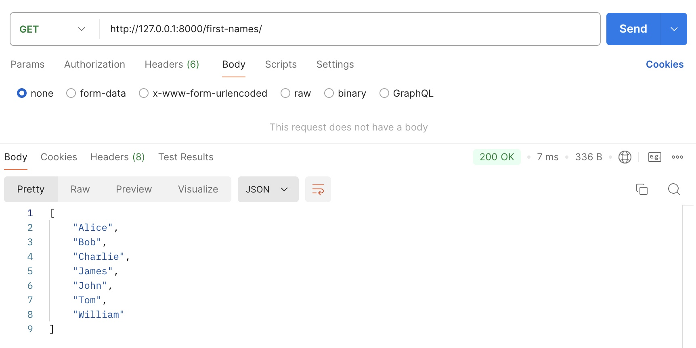
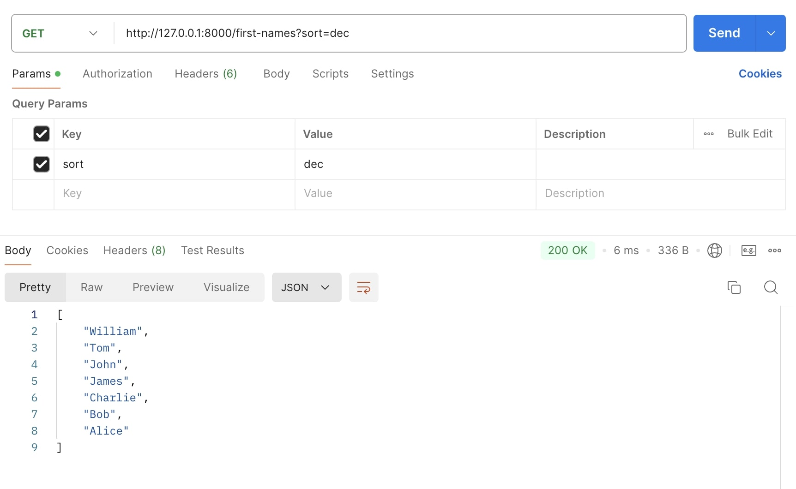
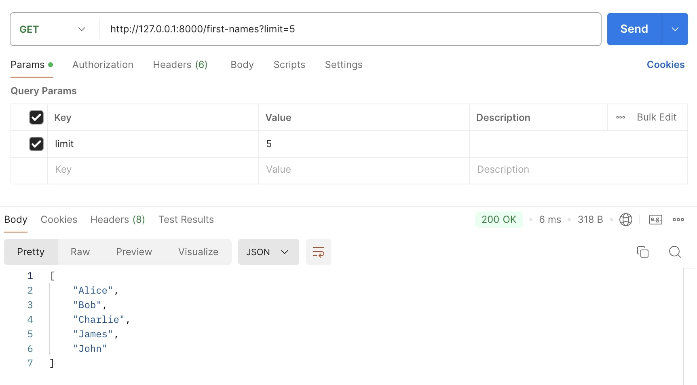
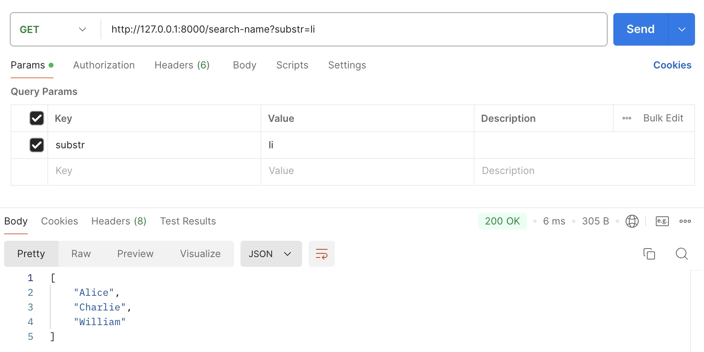
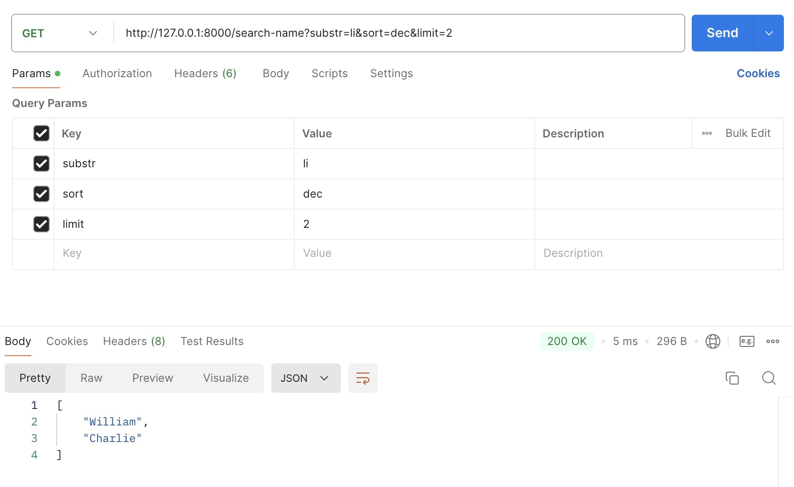
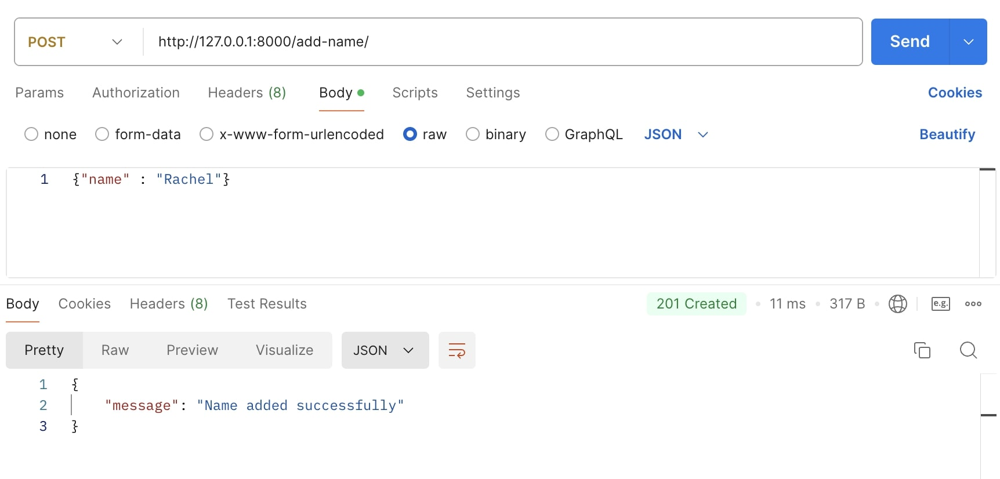

[![Contributors][contributors-shield]][contributors-url]
[![Forks][forks-shield]][forks-url]
[![Stargazers][stars-shield]][stars-url]
[![Issues][issues-shield]][issues-url]
[![MIT License][license-shield]][license-url]

# First Name API Project

This project is a simple backend API that allows for the management and querying of a list of first names stored in a MongoDB database. It is implemented using Django and MongoEngine.

## Features

The API supports the following features:

### 1. Retrieve All Names
- **Description**: Retrieves the list of all first names in the database.
- **Sorting**: The names can be sorted alphabetically in ascending or descending order.
- **Limiting**: The number of names returned can be limited.
- **Example Requests**:
  - GET `/first-names`
  - GET `/first-names?sort=asc`
  - GET `/first-names?sort=dec`
  - GET `/first-names?limit=10`
  - GET `/first-names?limit=10&sort=dec`

### 2. Search by First Name
- **Description**: Searches for names that contain a specified substring.
- **Sorting**: The search results can be sorted alphabetically.
- **Limiting**: The number of search results returned can be limited.
- **Example Requests**:
  - GET `/search-name=John`
  - GET `/search-name=John&sort=asc`
  - GET `/search-name=John&sort=dec`
  - GET `/search-name=John&sort=dec&limit=10`

### 3. Add a New Name
- **Description**: Allows the user to a new first name to the database.
- **Example Request**:
  - POST `/first-names` with JSON body `{ "name": "Jane" }`

## Installation

To get started with the project, follow these steps:

1. **Clone the repository:**
   ```bash
   git clone https://github.com/aidaaminian/first-name-api.git
   cd first-name-api
   ```

2. **Set up a virtual environment:**
   ```bash
   python3 -m venv .venv
   source .venv/bin/activate  # On Windows use `.venv\Scripts\activate`
   ```

3. **Install dependencies:**
   ```bash
   pip install -r requirements.txt
   ```

4. **Configure MongoDB:**
   - Make sure MongoDB is installed and running on your machine.
   - Configure your MongoDB connection settings in the `settings.py` file.

5. **Run the development server:**
   ```bash
   python manage.py runserver
   ```

6. **API Documentation:**
   - You can use tools like Postman or cURL to test the API endpoints.

## Project Structure

- `manage.py`: Django's command-line utility for administrative tasks.
- `web1/`: The main Django project directory.
  - `settings.py`: Contains the project’s configuration.
  - `urls.py`: Routes URLs to views.
  - `views.py`: Contains the logic for handling API requests.
  - `models.py`: Defines the `FirstName` model for MongoDB.
 
## Test Results
The API endpoints have been thoroughly tested using Postman. Below are the screenshots demonstrating the expected responses:









## Contributing

Contributions are what make the open source community such an amazing place to learn, inspire, and create. Any contributions you make are **greatly appreciated**.

If you have a suggestion that would make this better, please fork the repo and create a pull request. You can also simply open an issue with the tag "enhancement".

1. Fork the Project
2. Create your Feature Branch (`git checkout -b feature/AmazingFeature`)
3. Commit your Changes (`git commit -m 'Add some AmazingFeature'`)
4. Push to the Branch (`git push origin feature/AmazingFeature`)
5. Open a Pull Request

[contributors-shield]: https://img.shields.io/github/contributors/aidaaminian/first-name-api.svg?style=for-the-badge
[contributors-url]: https://github.com/aidaaminian/first-name-api/graphs/contributors
[forks-shield]: https://img.shields.io/github/forks/aidaaminian/first-name-api.svg?style=for-the-badge
[forks-url]: https://github.com/aidaaminian/first-name-api/network/members
[stars-shield]: https://img.shields.io/github/stars/aidaaminian/first-name-api.svg?style=for-the-badge
[stars-url]: https://github.com/aidaaminian/first-name-api/stargazers
[issues-shield]: https://img.shields.io/github/issues/aidaaminian/first-name-api.svg?style=for-the-badge
[issues-url]: https://github.com/aidaaminian/first-name-api/issues
[license-shield]: https://img.shields.io/github/license/aidaaminian/first-name-api.svg?style=for-the-badge
[license-url]: https://github.com/aidaaminian/first-name-api/blob/main/LICENSE
